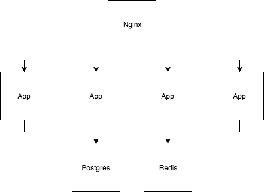

# Go URL Shortner

Go URL Shortner is a Golang implementation of a URL shortner.

## Technologies

- Go 1.9.2
- Nginx
- Postgresql
- Redis

## Setup

The project is fully setup using Docker Compose.

There're basically two ways to start the project: on `development mode` and on `server mode`.

### Development mode

The development mode creates all the necessary containers and dispatch a bash session inside the application container. It's useful to interact with the system in a low level, run the specs, etc.

Also, the compose file connects the application port `8080` to the host port `8080`. So, after starting the server, the application UI can be accessed via `http://localhost:8080/`.

```bash
# Start the system in development mode
$ docker-compose run --rm --service-ports dev

# Inside the bash session:

# Download the package manager and download the project dependencies
$ go get -u github.com/kardianos/govendor
$ govendor sync

# Run the specs
$ go test -v ./...

# Build the application binary
$ go build -i cmd/go-url-shortner/main.go

# Start the server (port: 8080)
$ ./main
```

### Server mode

Server mode aims to create a real scenario of a production running application.

Using the compose file, the application is automatically started and serving without any manual intervention.

Also, to simulate a real scenario of application replicas, the system has support to load balancing via Nginx. This way, all the requests are made to Nginx, which will delegate the request to one of the apps replicas.

By default, Nginx is configured to map 4 replicas.

```bash
# Prepare the application image
$ docker-compose build

# Start postgres and redis containers
$ docker-compose up -d db redis

# Start the 4 application replicas
$ docker-compose scale app=4

# Start the load balancer (i.e. Nginx)
$ docker-compose run --rm --service-ports nginx
```

The Nginx port `80` is automatically connected to the host port `80`. So, the application can be accessed via `http://localhost/`.

## Technical decisions

### Hash algorithm

Among all the possible hash algorithms used to generate the unique code for each URL, the following problems need to be considered:

1. **Code length**: The length of the unique code is crucial, since the purpose of the tool is, exactly, generate the smallest URL possible

2. **Code colision**: Using very small codes (or small dictionaries) can reduce the number of possible codes and, thus, lead to code colisions.

Considering the problems above, it was decided to use an ID to dictionary mapping.

The internal algorithm used on the solution implementation has a length of 62 characters. Using such dictionary, and considering that codes are acceptable as long they have a length of maximum 7 characters, this gives us a maximum of 3.5 trillions combinations.

The down side of such approach is that the codes are sequential, since they're generated based on the database's ID's. But since the URLs are public, it's not a problem.

### Why Golang?

Golang is a language that has a very good performance, in addition with a good code simplicity. The language has good native support to deal with HTTP requests and creating an API with the language is simple. Also, the final artifact is a native binary, which makes the execution time optimal, compared with interpreted languages.

### Why Postgres?

The nature of the data stored in the database is pure relational: an ID (which maps to a code) is mapped to a URL. So, makes no sense to use a NoSQL solution, for example.

Postgres is a robust relational database, open-source and with an active community. So, it's a good RDBMS choice.

### Why Redis?

Hitting the database for each URL query request is inefficient and can slow down the system under heavy load.

Redis was choosed to be an easy and resilient in-memory key-value store, with fast reading access. This way, every time a new URL is queried in the database, the record is stored in Redis. Thus, the next requests for the same URL will first query Redis, avoiding hitting the database and, thus, making the time spend on querying the record optimal.

### Architecture

Below is presented the architectural diagram of the system. 

The Nginx container acts like a load balancer, receiving the requests and delegating them to the apps replicas.

Each replica, on the other hand, has connection with the Postgres and Redis containers, used to store the new records.



## Next steps

There're room for some further improvements on this project, which were not achieved due the time constraints.

Below, are described the main topics:

- **Robot checking**: today, the UI doesn't contain any mechanism to identify automated scripts. This would be interesting, to avoid DDoS attacks on the system;

- **Metrics**: in any real life system, metrics and monitoring are important to identify bottlenecks and enhancements necessary in the system;

- **Service discovery**: the current Nginx load balancing implementation delegates the requests to specific service's addresses. In a real world environment, it's interesting to have some kind of service discovery. Since the project is fully "conternized", some technologies can solve this problem, such as Kubernates or Apache Zookeeper;

- **Further refactoring**: the system was built using the best practices and TDD. Nevertheless, it's always possible to refactor the code, aiming the best code structure and maintainability possible. Even being refactored over the development process, further refactoring and optimizations are always welcome.
